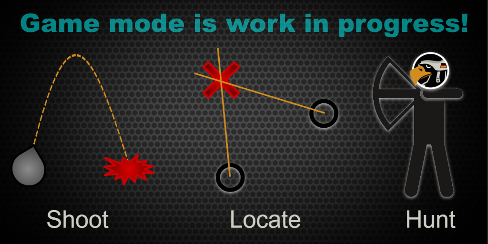

# Introduction
**Shoot and Scoot** is a TvT game mode in which 2 sides fight against each other.

Players of each side step into either of 3 roles:
* artillery
* sound directionfinders
* hunter-killer teams




### Artillery
The task of the **artillery** crews is to destroy all enemy resupply stations and win the game for the own team.

In order to find those stations they rely on targeting information from reconnaissance elements (e.g. UAV operators).


### Sound directionfinders
The crews of the **sound directionfinders** can use their vehicles as sensors that point into the direction of where artillery has been fired from.

They need to place these sensors wisely in order to enable accurate triangulation of enemy artillery batteries.

In addition to this ability they are also UAV operators, making them a multi-sensor reconnaissance role.


### Hunter-Killer teams
Hunter-Killer teams are very mobile motorized infantry teams that are meant to hunt down enemy artillery crews when they reveal their position through firing.


### Side Commander
The commander is the top-most leader of one side and the only person that is not a directionfinder operator but still sees the sensors bearings.


# Gameplay footage
Click banner to watch the videos

## Trailers
[](https://youtu.be/s6wskXYYYXY)
[](https://youtu.be/ziYV_R8k-tE)


## Live streams
* [Liru the Lance Corporal](https://www.youtube.com/@LirutheLanceCorporal) commenting from Zeus perspective
  * [](https://youtu.be/J5Y3seYMmlI)
  <a href="https://youtu.be/J5Y3seYMmlI"></a>
  <a href="https://youtu.be/PfVHyE1Ipxg"></a>
  
* [Instant Arma](https://www.youtube.com/@InstantArma) playing as a hunter-killer team member
  * [](https://youtu.be/9Do8yCZWnvM)
<a href="https://youtu.be/9Do8yCZWnvM"></a>


# Modset
The following mods are recommended to play this game mode (not all of which are mandatory):
```
@3cb factions;
@ace;
@cba_a3;
@Crows Electronic Warfare;
@diwako_dui;
@enhanced_movement;
@Enhanced Movement Rework;
@grad_D30_tweak;
@grad_slinghelmet;
@grad_trenches;
@gruppe_adler_mod;
@rhsafrf;
@rhsgref;
@rhssaf;
@rhsusaf;
@splendid_smoke;
@tfar animations;
@tfar;
@vet_unflipping;
@vurtuals_car_seat_n_stretcher;
@zen;
@zen_compat_ace;
```

# Documentation
* [Docu slide deck](https://docs.google.com/presentation/d/1BGDOxqqZw4T6js3oQ4mPr4E7f8NLZsPS85MUAAIYvco/edit?usp=sharing)
* [Readme of sound directionfinder mod](https://github.com/Perondas/arsr.VR/blob/main/README.md)
* [Docu on RHS towing](https://www.rhsmods.org/w/towing)
* [Demo video of sound directionfinder](https://www.youtube.com/watch?v=uboQB55MTRY)

